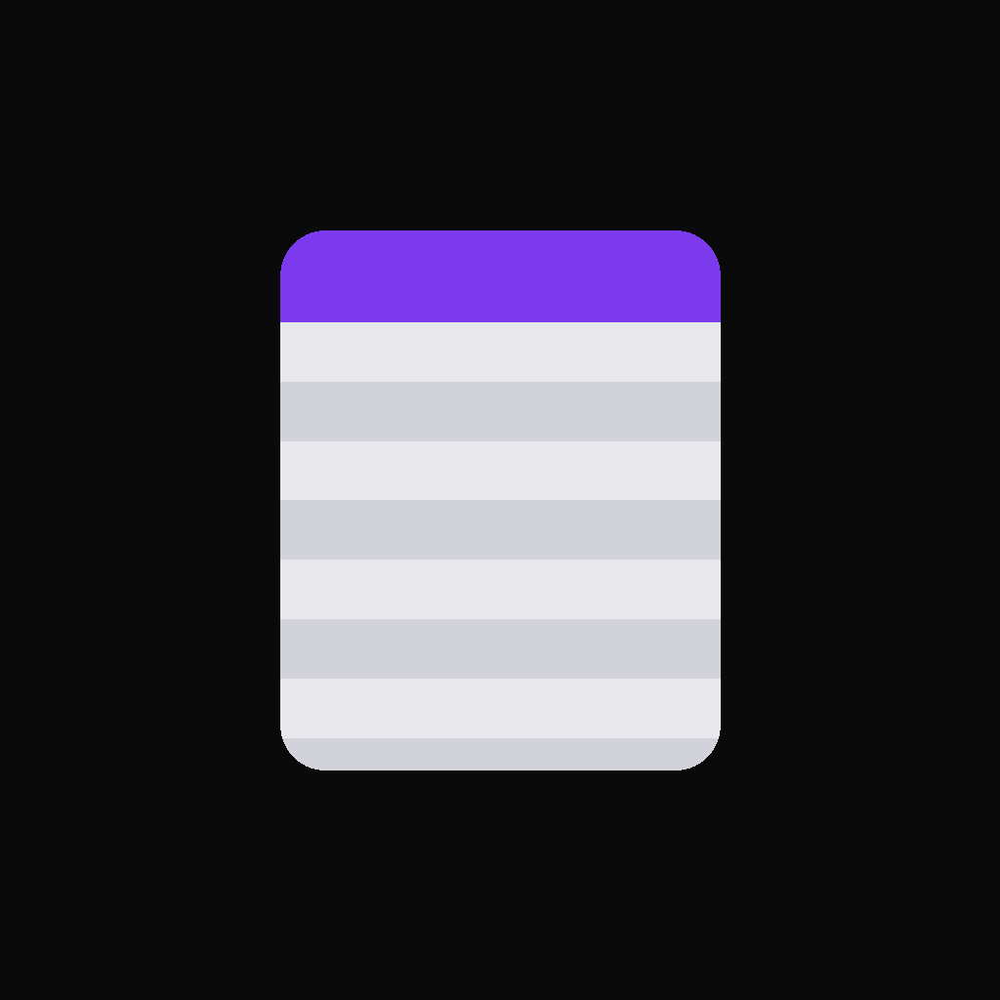
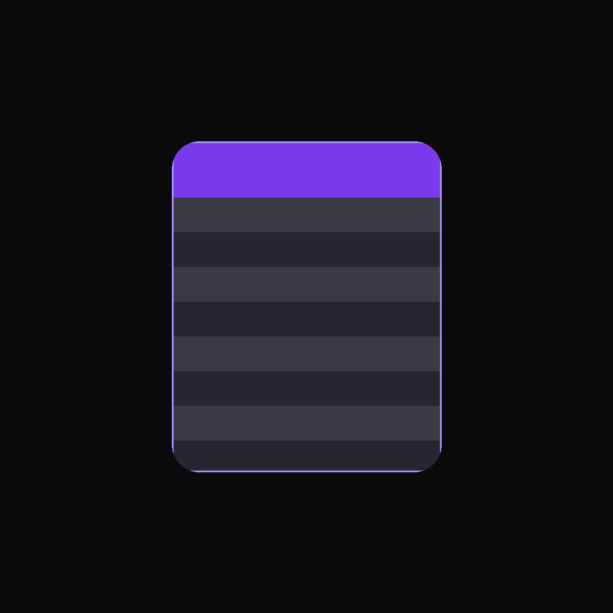
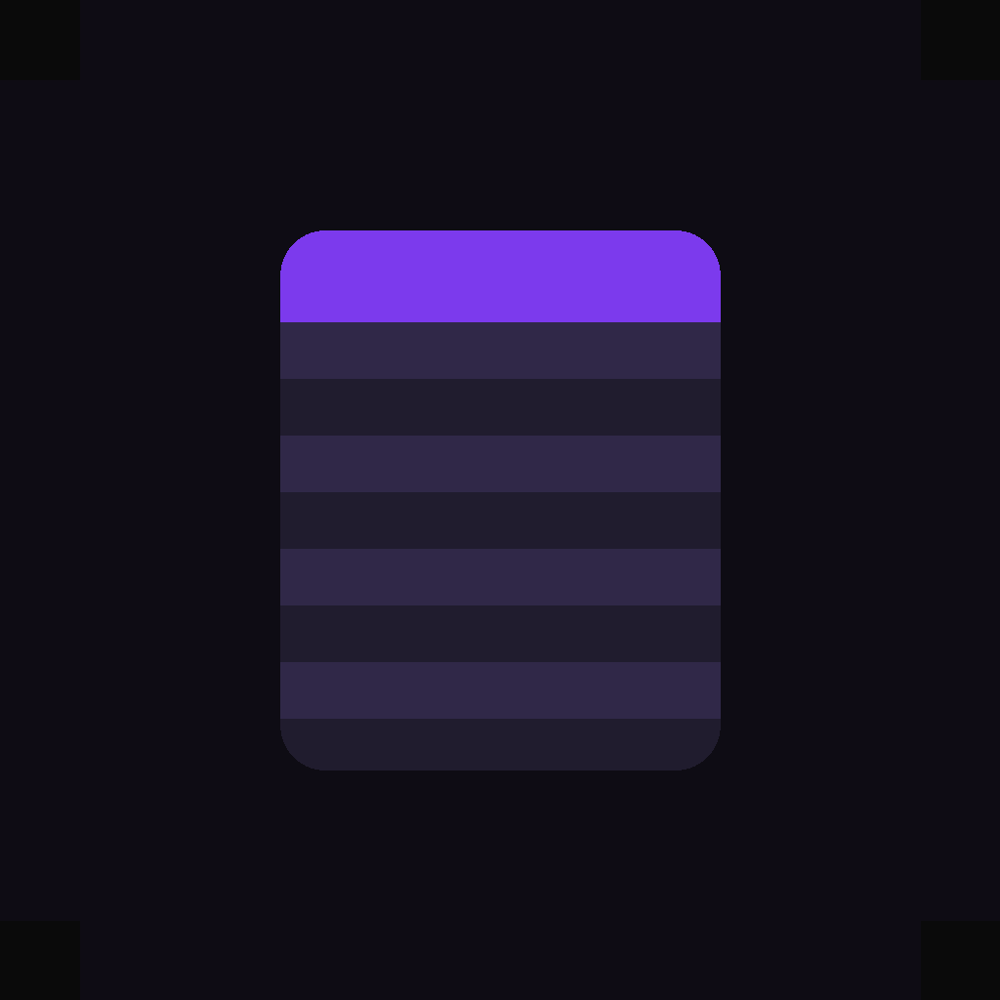
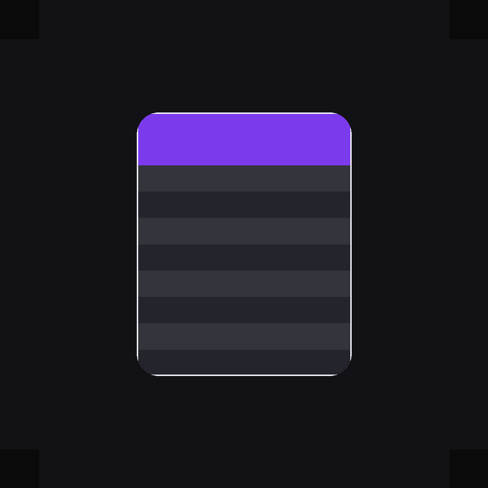
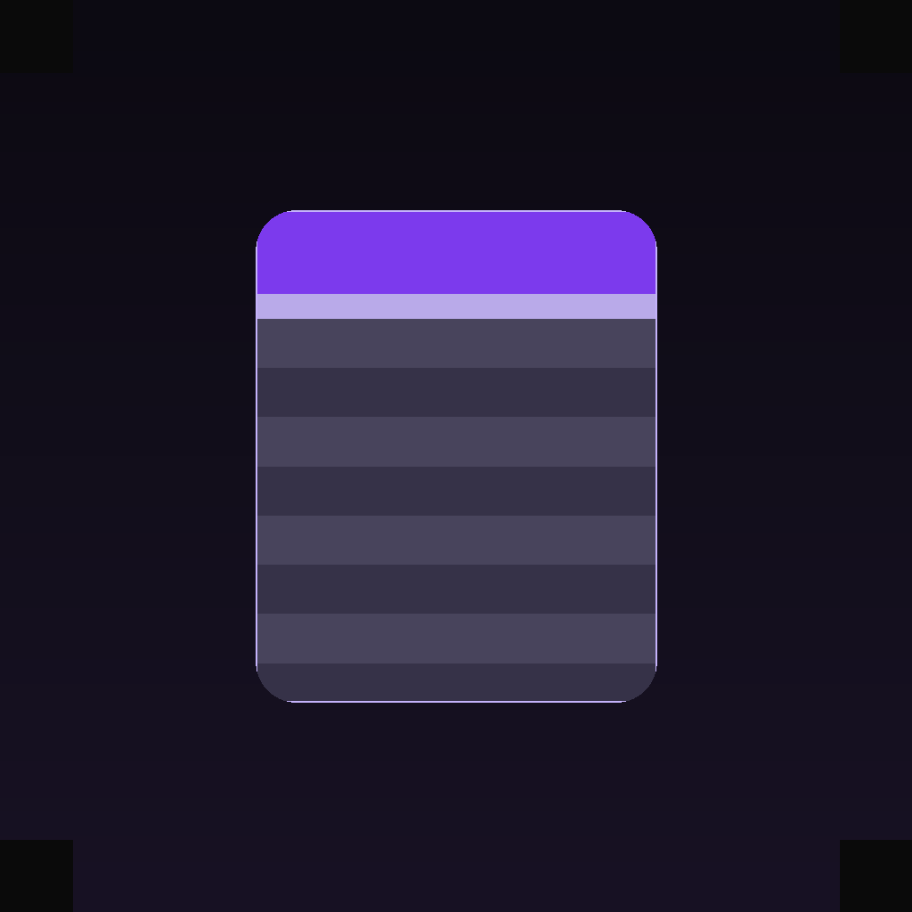

# BeatDeal — Propositions logo app

## A — Document clair

Corps blanc cassé + bandes grises visibles. Contraste maximal, lisible en petit.

## B — Carte surélevée

Fond noir + carte gris anthracite + bordure violette fine + bandes alternées.

## C — Teinte violette

Carte sombre mais bandes teintées violet/gris — reste dark mode, plus de relief.

## D — Contour lumineux

Document sombre avec contour blanc/violet et header plus large.

## E — Glass premium

Effet verre : fond dégradé, carte semi-claire, reflet discret en haut.

