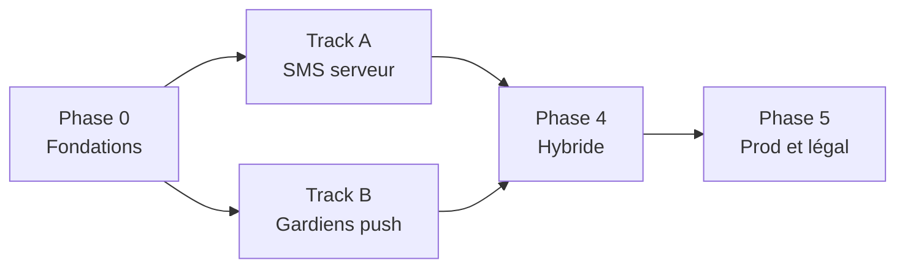

# Feuille de route RAS — Mode SMS serveur + Gardiens (push)

Document de planification pour une implémentation **ultérieure**.  
L’app actuelle (check-in local, alerte `mailto:` / Messages) reste en place pendant le développement.

---

## Objectifs produit

| Objectif | Mode SMS serveur | Gardiens + push |
|----------|------------------|-----------------|
| Fonctionner **sans 4G** (rando) | Oui — check-in par **réponse SMS** (GSM) | Oui pour l’alerte si session **déjà sync** ; le gardien a besoin de réseau pour la notif |
| Envoi **automatique** aux proches | Oui — serveur envoie SMS | Oui — serveur envoie push APNs |
| Proche doit installer RAS | Non | Oui |
| Proche appuie sur « Envoyer » | Non | Non |

**Position (rappel)** : en mode SMS, la position dans l’alerte = **dernière position syncée** (app avec réseau avant / au check-in), pas du live sans GSM.

---

## Vue d’ensemble des phases



| Phase | Durée indicative | Livrable |
|-------|------------------|----------|
| **0 — Fondations** | 1–2 sem. | API, DB, auth, sessions, déploiement |
| **A — SMS serveur** | 2–3 sem. | Check-up SMS + alerte contacts sans app |
| **B — Gardiens push** | 2–3 sem. | Invitation, relation, push alerte |
| **4 — Hybride** | 1 sem. | Modes combinés + file position offline |
| **5 — Prod** | 1–2 sem. | Légal, monitoring, coûts, TestFlight |

**Total ordre de grandeur :** 7–11 semaines à temps partiel ; 4–6 semaines si temps plein et expérience backend.

Les tracks **A** et **B** peuvent avancer **en parallèle** après la phase 0.

---

## Phase 0 — Fondations (commun aux deux tracks)

### 0.1 Choix stack

| Composant | Recommandation MVP | Alternative |
|-----------|-------------------|-------------|
| API | Supabase (Postgres + Edge Functions) ou FastAPI sur Railway | Node + Express |
| Auth | Sign in with Apple + JWT | Email magic link |
| SMS | Twilio (numéro FR + webhook entrant) | OVH SMS |
| Push | APNs via clé `.p8` (déjà utilisée pour TestFlight) | Firebase non nécessaire sur iOS pur |
| Jobs | Cron 1 min (Vercel cron / pg_cron / BullMQ) | — |

### 0.2 Schéma données minimal

```
users
  id, apple_sub?, phone_e164?, phone_verified_at, email?, created_at

sessions
  id, user_id, name, mode (app|sms|hybrid), status, interval_minutes,
  grace_minutes, next_check_at, last_checkin_at, last_position_lat/lon,
  last_position_at, alert_message, started_at, ends_at, alert_sent_at

checkins
  id, session_id, source (app|sms), received_at, raw_body?

emergency_contacts          -- pour SMS / email hors app
  id, user_id, name, phone_e164?, email?, priority, opt_in_at

device_tokens               -- pour push gardiens
  id, user_id, token, platform, updated_at

watch_relationships         -- Track B
  id, watcher_user_id, watched_user_id, status (pending|accepted|blocked),
  created_at, accepted_at

sms_outbound_log / sms_inbound_log
push_log
```

### 0.3 API v1 (REST)

| Route | Usage |
|-------|--------|
| `POST /auth/apple` | Login → JWT |
| `POST /auth/phone/start` + `verify` | Vérif numéro (Track A) |
| `POST /sessions` | Créer session (mode dans le body) |
| `POST /sessions/:id/ping` | Check-in app + GPS |
| `POST /sessions/:id/cancel` | Fin session |
| `GET /sessions/:id` | Statut UI |
| `POST /webhooks/sms/inbound` | Twilio (Track A) |

### 0.4 App iOS (minimal)

- [ ] Écran **Compte** (Sign in with Apple).
- [ ] À la **création de session** : `POST /sessions` si réseau (sinon message « connecte-toi avant de partir »).
- [ ] File d’attente **positions offline** : stocker localement, envoyer au prochain `ping` avec réseau.

### Critères de fin phase 0

- [ ] Session créée depuis l’app visible en base.
- [ ] Check-in app met à jour `last_checkin_at` et position.
- [ ] Cron tourne en staging (même sans SMS encore).

---

## Track A — Mode SMS serveur (sans connexion data)

### A.1 Fournisseur SMS

- [ ] Compte Twilio + numéro entrant FR (réception SMS).
- [ ] Webhook `POST /webhooks/sms/inbound` + **vérification signature** Twilio.
- [ ] Templates texte check-up / rappel / alerte (≤ 160 car. si possible).
- [ ] Budget / alertes coût (plafond SMS / jour).

### A.2 Vérification téléphone utilisateur

- [ ] `POST /auth/phone/start` → SMS code 6 chiffres.
- [ ] `POST /auth/phone/verify` → lie `phone_e164` au `user`.
- [ ] UI RAS : saisie numéro + code **avant** d’activer le mode SMS.

### A.3 Création session mode `sms`

- [ ] Body `POST /sessions` : `mode: "sms"`, intervalle, grace, contacts (phone), message alerte.
- [ ] Calcul `next_check_at` = now + interval.
- [ ] UI : toggle **« Contrôle par SMS »** + texte pédagogique (activer **avant** de perdre le réseau).
- [ ] Enregistrer **position de départ** obligatoire.

### A.4 Cron sortant (check-up)

Toutes les 1–2 minutes :

1. Sessions `active` + `mode in (sms, hybrid)` + `next_check_at <= now` + pas encore de SMS check-up pour ce cycle.
2. Envoyer SMS utilisateur :  
   `RAS [Nom] : tout va bien ? Réponds OUI avant HH:MM.`
3. Marquer `last_outbound_sms_at`, démarrer fenêtre de grâce.

### A.5 Webhook entrant (réponse utilisateur)

1. Normaliser `From` → user.
2. Parser `Body` : `OUI`, `OK`, `1` (liste blanche).
3. Session active la plus récente (ou ID dans le SMS).
4. Insérer `checkins`, `last_checkin_at = now`, `next_check_at += interval`.
5. Annuler rappels en cours pour ce cycle.

### A.6 Échec → alerte contacts

Si `next_check_at + grace` dépassé sans check-in valide :

1. [ ] 1–2 **SMS rappel** à l’utilisateur (optionnel).
2. [ ] SMS à chaque `emergency_contact` (phone) avec message + dernière position + lien Maps.
3. [ ] `status = alerted`, `alert_sent_at`, plus de check-up.
4. [ ] Log `sms_outbound_log`.

### A.7 Mode `hybrid` (recommandé avant prod)

- [ ] Si `ping` app reçu après `next_check_at` mais avant alerte → pas d’envoi SMS check-up inutile.
- [ ] Si ping app récent → recalcul `next_check_at` sans SMS.

### A.8 App iOS — écrans Track A

| Écran | Contenu |
|-------|---------|
| Activation mode SMS | Numéro vérifié, intervalle, contacts SMS, avertissements GSM |
| Session active SMS | « Prochain SMS : … », « Réponds OUI au +33… », Annuler session |
| Historique | Check-ins SMS + alertes envoyées |

### Critères de fin Track A

- [ ] Test réel : session 15 min, data coupée, réception SMS, réponse OUI, pas d’alerte.
- [ ] Test : pas de réponse → SMS aux contacts test.
- [ ] Test : activation sans réseau → message clair impossible.

---

## Track B — Gardiens + push (proches avec l’app)

### B.1 APNs côté serveur

- [ ] Clé APNs (même compte Apple que ASC).
- [ ] Envoi push **alert** (son + interruption time-sensitive si justifié).
- [ ] Payload : titre, corps, `session_id`, `watched_user_name`, lat/lon optionnels.

### B.2 Enregistrement device

- [ ] Demander permission notifications (déjà partiellement en place).
- [ ] `POST /devices` avec token APNs après login.
- [ ] Rafraîchir token à chaque lancement.

### B.3 Modèle « gardien »

| Statut | Signification |
|--------|----------------|
| `pending` | Invitation envoyée, pas encore acceptée |
| `accepted` | Reçoit les push alerte |
| `blocked` | Refus / signalement |

**Règle :** aucune alerte push sans `accepted`.

### B.4 Invitation

- [ ] `POST /invites` → token unique (UUID), expiration 7 j.
- [ ] Lien universel `https://ras.app/i/{token}` → ouvre app (Associated Domains plus tard ; v1 : code + deep link custom `ras://invite?token=`).
- [ ] UI A : « Inviter un gardien » → partage lien / QR.
- [ ] UI B : écran « X te demande d’être alerté si… » → Accepter / Refuser.
- [ ] `POST /invites/{token}/accept` → `watch_relationships.status = accepted`.

### B.5 Déclenchement alerte push

Même cron / même logique d’échec check-in que Track A :

1. Déterminer sessions en échec (pas de check-in app ni SMS selon mode).
2. Pour chaque gardien `accepted` de `watched_user_id` :
   - [ ] Push : « [Prénom] n’a pas répondu — [Nom session] ».
   - [ ] Données : dernière position, heure dernier contact.
3. [ ] Ne pas re-alerter en boucle (1 push par session / 24 h sauf config).

### B.6 UI gardien

| Écran | Contenu |
|-------|---------|
| « Mes gardiens » | Liste des personnes que je surveille + statut |
| « Ceux qui me surveillent » | Liste + révoquer accès |
| Détail alerte | Carte, appeler, historique session (limité vie privée) |

### B.7 Vie privée (non négociable)

- [ ] Le gardien **ne voit pas** la position en continu — seulement à l’alerte (et éventuellement dernier check-in).
- [ ] L’utilisateur surveillé peut **révoquer** un gardien à tout moment.
- [ ] CGU + case consentement gardien à l’acceptation.

### Critères de fin Track B

- [ ] Deux comptes test : A rate check-in → B reçoit push sans action manuelle.
- [ ] Invitation refusée → aucun push.
- [ ] B sans réseau au moment push → reçoit à la reconnexion (comportement APNs normal).

---

## Phase 4 — Intégration hybride

### 4.1 Modes utilisateur (réglages)

| Mode | Comportement |
|------|----------------|
| **App seule** | Actuel + sync serveur optionnelle |
| **SMS** | Check-up / alerte par SMS (Track A) |
| **Gardiens** | Push vers amis avec app (Track B) |
| **Complet** | SMS + gardiens + sync position ; check-in app si réseau |

### 4.2 Matrice contacts

Par contact :

- [ ] Type : `gardien_app` | `sms` | `email`
- [ ] Un contact peut être les deux (gardien + SMS backup).

### 4.3 Position offline

- [ ] Queue locale `pending_pings` (lat, lon, timestamp).
- [ ] Sync au retour réseau avant ou après check-in SMS.
- [ ] Alerte utilise `last_position_at` + coordonnées en base.

### Critères de fin phase 4

- [ ] Scénario rando documenté en test E2E (script interne).
- [ ] Un seul écran « Comment ça marche » selon le mode choisi.

---

## Phase 5 — Production

### 5.1 Légal & confiance

- [ ] Politique de confidentialité (numéros, positions, logs SMS).
- [ ] CGU (usage abusif, fausses alertes).
- [ ] Consentement contacts + gardiens horodaté en base.
- [ ] DPA Twilio / hébergeur.
- [ ] Hébergement UE si possible.

### 5.2 Ops

- [ ] Monitoring webhook SMS (échec signature, 5xx).
- [ ] Alerte admin si > N SMS / heure (abus).
- [ ] Logs structurés + rétention 90 j.
- [ ] Staging vs production (2 numéros Twilio ou sous-comptes).

### 5.3 Monétisation (optionnel)

- [ ] Gratuit : mode app + 1 gardien.
- [ ] Pro : mode SMS + N gardiens + X SMS / mois inclus.

### 5.4 App Store

- [ ] Description : mode rando SMS, limite GSM, pas PLB.
- [ ] Captures écrans mode SMS + gardiens.
- [ ] Pas de promesse « 100 % sans réseau ».

---

## Ordre de développement recommandé

```
Semaine 1–2   Phase 0 (fondations)
Semaine 3–4   Track A (SMS) — valeur rando immédiate
Semaine 3–5   Track B (gardiens) en parallèle si 2e dev ou après A
Semaine 6     Phase 4 (hybride)
Semaine 7     Phase 5 (prod) + bêta TestFlight fermée
```

Si **une seule personne** : faire **0 → A → B → 4 → 5** (SMS avant gardiens, car différenciant rando).

---

## Dépendances iOS existantes

| Déjà en place | À ajouter |
|---------------|-----------|
| Notifications locales, check-in, GPS | Sign in with Apple |
| TestFlight / signing | Associated Domains (invitations web, v2) |
| `BGTask` identifiant | Backend réel |
| Mode app alerte `mailto:` | Feature flags par mode |

---

## Risques & mitigations

| Risque | Mitigation |
|--------|------------|
| Faux positif (pas de GSM) | Grace longue, 2 rappels, texte clair |
| Coût SMS | Plafond, mode Pro |
| Abus invitations | Acceptation obligatoire, rate limit, signalement |
| Webhook down | Queue retry, alerte ops |
| Rejet App Store (urgence) | Wording « bien-être », pas « remplace le 112 » |
| Spam email (si ajouté plus tard) | Track séparé, pas dans cette roadmap |

---

## Hors scope (v2+)

- Email serveur automatique (backup séparé).
- Apple Watch app.
- Garmin / satellite APIs.
- Partage position temps réel type Find My.
- App Android.

---

## Checklist « prêt pour bêta fermée »

- [ ] Phase 0 terminée
- [ ] Track A ou B au choix **minimum un des deux** en prod staging
- [ ] 10 testeurs avec scénarios écrits
- [ ] CGU + confidentialité en ligne
- [ ] Page statut / contact support
- [ ] Bascule feature flag `sms_mode_enabled` / `guardians_enabled`

---

## Références internes

- [TESTFLIGHT.md](./TESTFLIGHT.md) — CI et déploiement iOS
- Code actuel : `AlertDispatcher.swift` (mailto), `NotificationScheduler.swift` (local)
- Conversation architecture : mode SMS = serveur ; gardiens = APNs + relations

*Dernière mise à jour : juin 2026 — à réviser avant le kick-off dev.*
